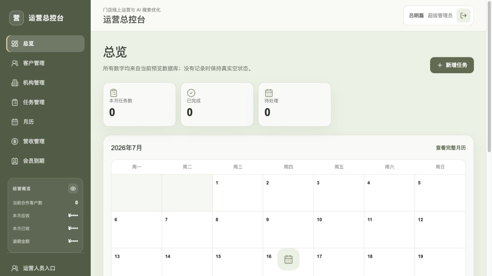
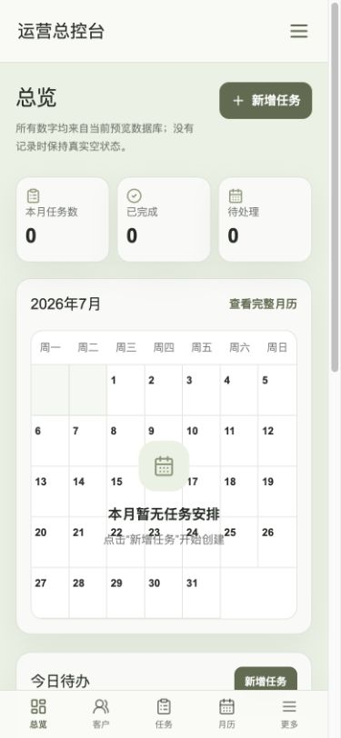

# Agent 代运营系统第一阶段报告

## 范围与交付

- 分支：`feature/agent-ops-control-center-phase1`
- 主要提交：`3d08336`（第一阶段基础）、`945a044`（可复现 OpenNext 依赖）、`7b59ffd`（任务优先总控台与运营人员隔离）
- 预览 Worker：`health-agent-preview`
- 预览 D1：`health-agent-preview-db`（`efe75183-7001-4da7-8e3a-30528a3ef5eb`）
- 当前预览版本：`97bef49a-9db9-449f-b956-220d621c1e26`

本阶段仅操作独立 worktree、上述预览 Worker 与预览 D1。未部署生产 Worker、未执行生产 migration、未读写生产数据，未修改生产域名、DNS 或 Secret。

## OpenNext 500 修复

### 最终根因

原预览构建复用了指向另一个 worktree 的 `node_modules`，且仓库没有 pnpm 锁文件；因此虽然 `package.json` 声明为 `@opennextjs/cloudflare 1.19.11`，构建实际依赖树不可复现。该陈旧/共享安装树在 Worker 运行时触发了：

`Dynamic require of "/.next/server/middleware-manifest.json" is not supported`

这不是 Phase 1 的 `/cyrus` 重定向或 middleware 权限逻辑造成的。`src/middleware.ts` 没有 `runtime = "nodejs"`，也没有 Node-only 依赖。

### 修复措施

1. 删除共享的 `node_modules` 链接与旧构建产物。
2. 将项目固定为 `pnpm@11.7.0`，生成并提交唯一的 `pnpm-lock.yaml`，移除 `package-lock.json`，避免 npm/pnpm 双依赖树。
3. `package.json`、pnpm 锁文件、项目本地安装与 `pnpm why` 均确认 `@opennextjs/cloudflare` 为精确的 `1.19.11`。
4. 通过 `pnpm install --frozen-lockfile` 重建，并使用项目本地命令：

   ```sh
   pnpm exec opennextjs-cloudflare build --config wrangler.agent.preview.jsonc
   ```

5. 构建产物检查确认最终 Worker 与服务函数中均不包含失败时的精确动态 require 文本，也不包含对 `/.next/server/middleware-manifest.json` 的直接 require。

OpenNext 构建日志实际使用：OpenNext `1.19.11`、Next.js `15.5.19`、OpenNext AWS `4.0.2`。

## 预览验收

预览部署后验证结果：

| 路由 | 结果 |
| --- | --- |
| `/` | 200 |
| `/login` | 200 |
| `/app`（未登录） | 307 → `/login` |
| `/lvminglei` | 200（管理员登录入口） |
| `/agent-admin` | 200 |
| `/cyrus` | 307 → `/lvminglei` |
| `/survey` | 404 |
| `/yingyun` | 404 |

- 远端桌面浏览器：首页与管理员登录入口均正常渲染，控制台无 error/warn。
- 远端 390px 浏览器：首页 `clientWidth/scrollWidth = 390/390`，无横向溢出。
- 本地 OpenNext Worker 复验同一路由矩阵全部通过，未再出现 500 或动态 require 报错。
- Worker 部署输出确认 `DB` 绑定仍为 `health-agent-preview-db`。

## 总控台布局调整

超级管理员桌面端：

- 首页顶部只保留“本月任务数、已完成、待处理”三张紧凑任务卡。
- 日历成为首页主视觉，顺序为任务指标、日历、今日待办、即将到期、最近任务。
- “当前合作客户数、本月应收、本月已收、逾期金额”移入左侧导航下半部的“经营概览”。
- 金额默认遮挡为 `¥••••`，显示/隐藏按钮只影响界面显示；数据仅在 owner layout 服务端读取并传给超级管理员侧栏。

手机端：

- 首页只显示三项任务指标、日历、今日待办和即将到期。
- 手机首页可见区域不出现财务标签；营收仅保留在管理员的“更多 → 营收管理”路径。
- 390px 无横向滑动统计卡。

验收截图：





## 运营人员隔离

- `/app` 改为内容生成工作台：当前被分配机构选择、公众号文章、朋友圈内容、小红书内容、短视频文案、AI 搜索文章、最近生成、草稿和历史记录。
- 运营人员生成内容时，机构 ID 会在 Server Action 中按分配关系验证；生成资料只取该机构的内容资料。
- 运营人员导航移除账号、店铺资料、合同、费用、收款、续费、会员到期、客户与管理员月历入口。
- 运营人员直接访问 `/app/account` 或 `/app/store-profile` 会安全跳回工作台。
- 营收页与合同/收款 Server Action 持续使用 `requireWorkbenchOwner` 服务端守卫；运营人员无法仅靠 CSS 或直接调用绕过。
- 回归测试检查运营人员页面与动作中不包含 `monthly_fee`、`expected_amount`、`paid_amount`，也不读取合同或收款数据。

## 验证结果

- `pnpm install --frozen-lockfile`：通过
- `pnpm test`：34 个文件、160 项测试通过
- `pnpm lint`：通过
- `pnpm build`：通过
- `pnpm exec opennextjs-cloudflare build --config wrangler.agent.preview.jsonc`：通过
- 本地桌面与 390px 浏览器：通过；金额显示开关已交互验证，控制台无 error/warn。

## 上线阻塞项

无第一阶段代码或预览部署阻塞项。

已知、非阻塞说明：真实微信二维码素材尚未配置，公开首页继续只展示微信号 `Montes_Runa`；运营人员草稿保存模块尚未开发，界面明确显示真实空状态，已生成内容可在历史记录查看。
